```shell
当你的才华撑不起你的野心的时候，那就安静的学习吧
```

# 一、上课环境介绍

#### 远程桌面

> 目前我们上课使用的是realvnc,讲师自己部署VNC® Server,学生安装VNC® Viewer即可

**常见远程桌面工具**

**RealVNC**


地址:https://www.realvnc.com/en/

> RealVNC远程控制程序是VNC （Virtual Network Computing）众多操作平台版本中的一员，它可以安装在Windows中而让使用者在世界各地远端遥控自己的电脑，就算是遥控不同的操作平台也没有问题。
>
> VNC软件主要由两个部分组成：VNC server及VNC viewer。用户需先将VNC server安装在被控端的计算机上后，才能在主控端执行 VNC viewer 控制被控端。 VNC server 与 VNC viewer 支持多种操作系统，如 windows，Linux，MacOS 及 Unix 系列（Unix，Solaris等），因此可将 VNC server 及 VNC viewer 分别安装在不同的操作系统中进行控制。RealVNC 的优越性还在于如果操作系统的主控端计算机没有安装 VNC viewer，也可以通过一般的网络浏览器（如 IE 等）来控制被控端（需要 Java 虚拟机的支持）。

**Teamviewer**


地址:http://www.teamviewer.com/en/index.aspx

> Teamviewer是最佳的远程桌面工具之一，使用它可以轻松连接到全球任意一台PC或服务器上，目前大约有2亿用户在使用Teamviewer。
>
> TeamViewer是一个能在任何防火墙和NAT代理的后台用于远程控制，桌面共享和文件传输的简单且快速的解决方案。为了连接到另一台计算机，只需要在两台计算机上同时运行 TeamViewer 即可，而不需要进行安装（也可以选择安装，安装后可以设置开机运行）。该软件第一次启动在两台计算机上自动生成伙伴 ID。只需要输入你的伙伴的ID到TeamViewer，然后就会立即建立起连接。
>
> Teamviewer面向个人使用是免费的，但会弹出烦人的广告。

**AnyDesk**


地址：https://anydesk.com/zhs/downloads

>通过远程访问连接各个Windows客户端和服务器的桌面
>
>通过远程连接控制所有的Windows设备，实现即时支持和实时管理
>
>AnyDesk拥有令人叹为观止的帧速率，带宽效率和难以察觉的延迟，为您提供Windows中流畅的远程桌面连接
>
>使用远程桌面访问Windows轻松协作并进行在线通信

# 二、IDC/机柜/物理Server类型/云主机介绍

### 1、互联网数据中心

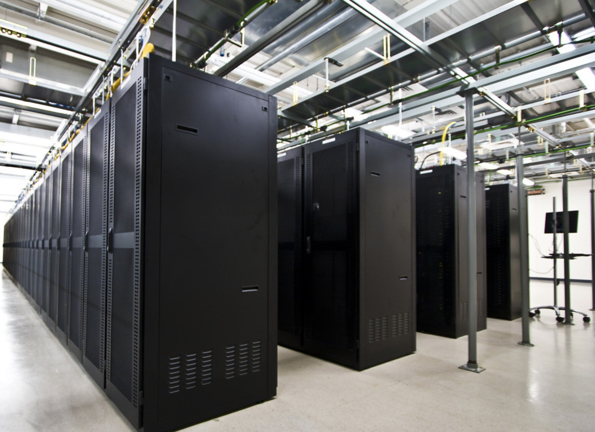

> 互联网数据中心（Internet Data Center）简称IDC，就是电信部门利用已有的互联网通信线路、带宽资源，建立标准化的电信专业级机房环境，为企业、政府提供服务器托管、租用以及相关增值等方面的全方位服务。
>
> IDC主机托管主要应用范围是网站发布、虚拟主机和电子商务等。比如网站发布，单位通过托管主机，从电信部门分配到互联网静态IP地址后，即可发布自己的www站点，将自己的产品或服务通过互联网广泛宣传；虚拟主机是单位通过托管主机，将自己主机的海量硬盘空间出租，为其他客户提供虚拟主机服务，使自己成为ICP服务提供商；电子商务是指单位通过托管主机，建立自己的电子商务系统，通过这个商业平台来为供应商、批发商、经销商和最终用户提供完善的服务。
>

**IDC机房的维护运营**

> 保障机房设备正常运行，通过对机房环境支撑系统、监控设备、计算机主机设备定期检测、维护和保养，保障机房设备运行稳定，通过保养延长设备生命周期，降低故障率。确保机房在突发事故导致硬件设备故障，影响机房正常运作情况下，可及时得到设备供应商或机房服务维护人员的产品维修和技术支持，并快速解决故障。
>
> 1、机房除尘及环境要求：定期对设备进行除尘处理，清理，调整安保摄像头清晰度，防止由于机器运转、静电等因素将尘土吸入监控设备内部。同时检查机房通风、散热、净尘、供电、架空防静电地板等设施。机房室内应该根据GB50174-2017《电子计算机机房设计规范》要求，温度为20±2℃，相对湿度应控制在45%~65%。
>
> 2、机房空调及新风维护：检查空调运行是否正常，换风设备运转是否正常。从视镜观察制冷剂液面，看是否缺少制冷剂。检查空调压缩机高、低压保护开关、干燥过滤器及其他附件。
>
> 3、UPS及电池维护：根据实际情况进行电池核对性容量测试；进行电池组充放电维护及调整充电电流，确保电池组正常工作；检查记录输出波形、谐波含量、零地电压；查清各参数是否配置正确；定期进行UPS功能测试，如UPS同市电的切换试验。
>
> 4、消防设备维护：检查火警探测器、手动报警按钮、火灾警报装置外观及试验报警功能；检查火灾警报控制器的自检、消音、复位功能及主备用电源切换功能。
>
> 5、电路及照明电路维护：镇流器、灯管及时更换，开关更换；线头氧化处理，标签巡查更换；供电线路绝缘检查，防止意外短路。
>
> 6、机房基础维护：静电地板清洗清洁，地面除尘；缝隙调整，损坏更换；接地电阻测试；主接地点除锈、接头紧固；防雷器检查；接地线触点防氧化加固。
>
> 7、机房运维管理体系：维护人员24小时及时响应。

### 2、服务器机柜


> 服务器机柜，用来组合安装面板、插件、插箱、电子元件、器件和机械零件与部件，使其构成一个整体的安装箱。服务器机柜由框架和盖板（门）组成，一般具有长方体的外形，落地放置。它为电子设备正常工作提供相适应的环境和安全防护。这是仅次于系统级的一级组装。不具备封闭结构的机柜称为机架。服务器机柜具有良好的技术性能。机柜的结构应具有良好的刚度和强度以及良好的电磁隔离、接地、噪声隔离、通风散热等性能。此外，服务器机柜应具有抗振动、抗冲击、耐腐蚀、防尘、防水、防辐射等性能，以便保证设备稳定可靠地工作。

**技术要求**

> 服务器机柜在机柜的深度、高度、承重等方面均有要求。常规高度为47U、42U、37U、32U、27U、22U、18U；宽度为800mm、600mm；深度为800mm、900mm、960mm、1000mm、1100mm、1200mm。

**机柜配置**

> 可以配置：专用固定托盘、专用滑动托盘、电源插排、脚轮、支撑地脚、理线环、理线器、L支架、横梁、立梁、风扇单元，机柜框架、上框、下框、前门、后门、左右侧门可以快速拆装。
>
> 固定托盘：用于安装各种设备，尺寸繁多，用途广泛，有19"标准托盘、非标准固定托盘等。常规配置的固定托盘深度有450mm、550mm、650mm、710mm、750mm等规格。固定托盘的承重不小于50KG。
>
> 滑动托盘：用于安装键盘及其他各种设备，可以方便地拉出和推回；19"标准滑动托盘适用于任何19"标准机柜。常规配置的滑动托盘深度有450mm、550mm、650mm、710mm、750mm等规格。滑动托盘的承重不小于20KG。
>
> 电源插排：适合于10A国标电源插头，可直接安装在机柜安装量上。规格：6插口。参数：~220V，10Amp。
>
> 理线器：19"标准理线器。可选配安装在机柜内使用，安装在机柜立梁上。
>
> 理线环：使用内的理线装置，安装在机柜立梁上，安装和拆卸非常方便，使用的数量和位置可以任意调整。
>
> L支架：L支架可以配合机柜使用，用于安装机柜中的19"标准设备，主要是用于安装机架式服务器使用。
>
> 盲板：盲板用于遮挡19"标准机柜内的空余位置等用途，有1U、2U......等多种规格。常规盲板为1U、2U两种。
>
> 横梁、立梁：主要是用于扩展机柜内的安装空间之用，可根据设备大小自由调整。安装和拆卸非常方便。
>
> 安装螺母（方螺母）：用于机柜内的所有设备的安装，包括机柜的大部分配件的安装。
>
> 键盘抽屉：用于安装标准计算机键盘，适用于19”大小计算机键盘。键盘抽屉必须配合滑动托盘使用。
>
> 风扇单元：安装于机柜的顶部，用于机柜内排风，有效的降低了机柜内温度，使设备更好的运作。
>
> 机架式风机单元：高度为1U，可安装在19"标准机柜内的任意高度位置上，可根据机柜内热源酌情配置。
>
> 网孔前门：网孔门有效的解决机柜内设备散热问题，使机柜内设备更好的运作。常规网孔门通风孔通风面积不少于柜门面积的70%，能提供最佳的水平空气流通。
>

服务器介绍

A.塔式服务器

​	塔式服务器是我们生活中见得比较多的，主要是因为塔式服务器的外形结构和普通PC比较类似。塔式服务器尺寸没有统一标准，由于塔式服务器的机箱比较大，服务器的配置也可以很高，冗余扩展更可以很齐备，所以它的应用范围非常广，应该说目前使用率最高的一种服务器就是塔式服务器。

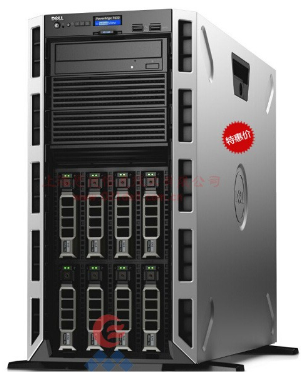	

B.机架式服务器

机架式服务器的外形看来不像计算机，而像交换机，有1U（1U=4.445厘米=1.75英寸）、2U、4U等规格。机架式服务器安装在标准的19英寸机柜里面。这种结构的多为功能型服务器。

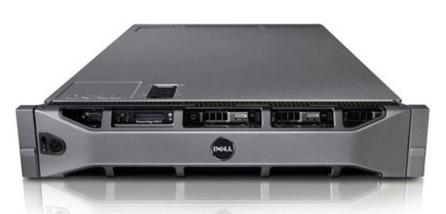

C.刀片式服务器

​	刀片服务器是指在标准高度的机架式机箱内可插装多个卡式的服务器单元，是一种实现HAHD(高可用高密度)的低成本服务器平台，为特殊应用行业和高密度计算环境专门设计。刀片服务器就像“刀片”一样，每一块“刀片”实际上就是一块系统主板。

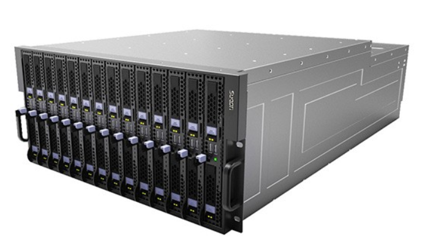

##### 

### 3、云服务器

#### **3.1、云服务器介绍**


> 1. 什么是云服务器？
>
> 云计算服务器（又称云服务器或云主机），是云计算服务体系中的一项主机产品，在实际应用中的云主机具有三个方面的弹性能力：
>
> 主机服务配置与业务规模可根据用户的需要进行配置，并可灵活的进行调整。 用户申请的主机服务可以实现快速供应和部署(实时在线开通)，实现了集群内弹性可伸缩 计费方式灵活，用户无需支付押金，且有多种支付方式供用户选择。
>
> 2.与租用物理服务器相比，云服务器的主要优势是什么？
>
> 云服务器租用价格低于传统的物理服务器租用，且无需支付押金。 具有快速供应和部署能力，用户在提交云主机租用申请后可实时开通，立即获得服务。 业务支持平滑扩展，当用户业务规模扩张时，可快速实现业务扩容。
>
> 3.云服务器能否申请多个IP？
>
> 云服务器根据用户选择不同的线路会配备不同数量的IP地址。 单线路默认赠送一个独立IP，双线路二个独立IP；因增加IP造成带宽无法限制，暂时不予增加IP。
>
> 4.用户可以选择安装操作系统么？
>
> 可以。云主机在产品使用形态上与传统的物理服务器并没有明显的差别，用户可以根据自己的需求灵活选择或变更的操作系统。
>
> 5.如果想购买开通，需要多长时间？想要扩展需要多长时间？
>
> 注册用户->在线支付->购买云服务器，实时开通。开通后登录用户管理区→云服务器管理→管理→预装操作系统，可以选择Windows 2008、Windows 2012、Cent OS 6.5等操作系统，系统安装需要10~25分钟，系统安装完成后就可以通过远程连接进行其他应用操作。
>
> 6.云服务器租用需要交押金吗？
>
> 与传统物理服务器租用不同，云服务器租用用户不需要支付押金即可享受服务。
>
> 7.备份盘能否用来存放我的文件？
>
> 备份磁盘用于系统智能备份服务，主要用于灾难恢复情况下使用。
>
> 8.任务管理器内有几个CPU？
>
> 安装完操作系统后，必须重新启动云服务器，才可以看到多个CPU，但如果只购买一个CPU除外。

#### **3.2、常见云服务提供商**

**阿里云**

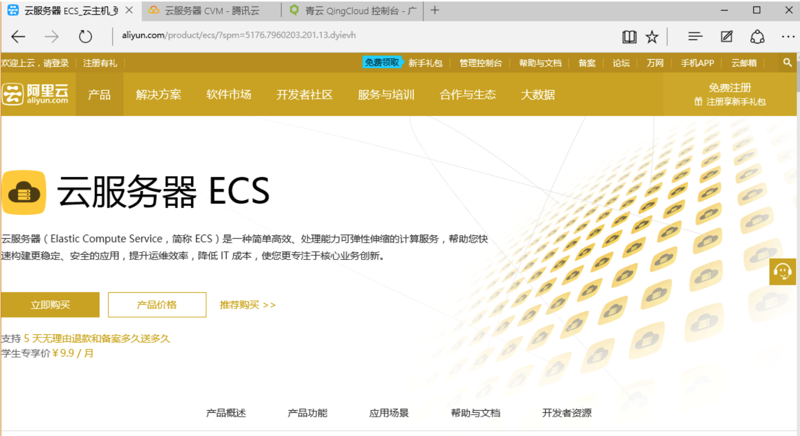

**青云**


**腾讯云**

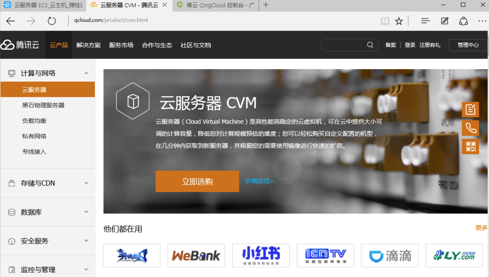

**华为云**

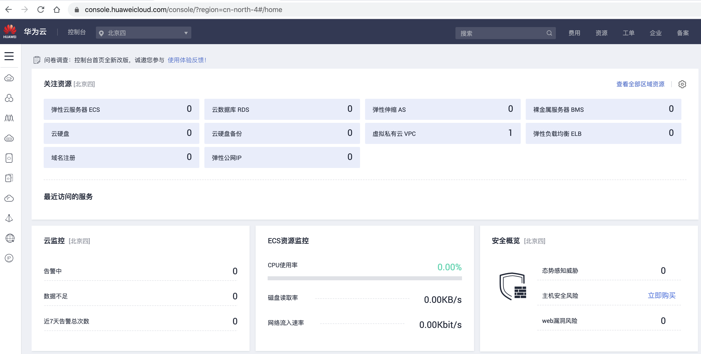

# 三、Linux操作系统简介


### 1、Linux历史简述

> 操作系统始于二十世纪五十年代，当时的操作系统能运行批处理程序。批处理程序不需要用户的交互。
>
> 二十世纪六十年代初，交互式操作系统开始流行。它不仅仅可以交互，还能使多个用户从不同的终端同时操作主机。这样的操作系统被称作分时操作系统，它的出现对批处理操作系统是个极大的挑战。许多人尝试开发分时操作系统， 其中包括一些大学的研究项目和商业项目。当时有个项目叫做 Multics ，它的技术在当时很具有创新性。 Multics 项目的开发并不顺利，它花费了远超过预计的资金，却没有在操作系统市场上占到多少份额。而参加该项目的一个开发团体——贝尔实验室退出了这个项目。他们在退出后开发了他们自己的一个操作系统—— UNIX 。
>
> UNIX 最初免费发布并因此在大学里受到欢迎。后来，UNIX 实现了 TCP/IP 协议栈，成为了早期工作站的操作系统的一个流行选择。
>
> 1990 年，UNIX 在服务器市场上尤其是大学校园中成为主流操作系统，许多校园都有 UNIX 主机，当然还包括一些研究它的计算机系的学生。

走进Linux世界

```shell
1.Linux能做什么？
Linux和我们常见的Windows一样，都是操作系统，但不同的是：
Windows： 收费的，不开源的，主要用于日常办公、游戏、娱乐多一些。
Linux： 免费的，开源的，主要用于服务器领域，性能稳定，安全。
例如：新浪、百度、淘宝等互联网公司，他们使用的服务器全都是Linux系统；全球500强企业95%的服务器使用的都是Linux系统。
```

##### 1.1GNU/Linux 的历史

```shell
Linux系统是一套免费使用和自由传播的UNIX操作系统（主要用在服务器上），是一个基于UNIX的操作系统。它能运行主要的UNIX工具软件它支持32位和64位硬件。

UNIX：操作系统，是美国AT&T公司贝尔实验室于1969年完成的操作系统，最早由肯•汤普逊（Ken Thompson），丹尼斯•里奇（Dennis Ritchie）开发。在1971年首次对外发布，刚好在1971，丹尼斯•里奇（Dennis Ritchie）发明了C语言，后来在1973，Unix被他用C语言重新编写。
```

既然是历史，就让它成为历史吧。。。。。。但请记住他们：

**1.1 自由软件之父**


理查德·马修·斯托曼（1953~），自由软件运动的精神领袖、GNU计划以及自由软件基金会的创立者、著名黑客。

```shell
GNU：1983年（理查德•马修•斯托曼）创立GNU计划。一套完全自由的操作系统，这个操作系统是GNU计划的主要目标（发展出一套完整的开放源代码操作系统来取代Unix）.
```

##### 1.2Linux 之父 

林纳斯•本纳第克特•托瓦兹（Linus Benedict Torvalds, 1969年~ ），著名的电脑程序员、黑客。Linux内核的发明人及该计划的合作者。托瓦兹利用个人时间及器材创造出了这套当今全球最流行的操作系统（作业系统）内核之一。全力开发Linux内核。1991 www.kernel.org 


```shell
Linux操作系统诞生于1991年10月5日（这是第一次正式向外公布时间），与UNIX兼容，现在，Linux产生了许多不同的Linux发行版本，但它们都使用了Linux内核。Linux可安装在各种计算机硬件设备中，比如手机、平板电脑、视频游戏控制台、台式计算机、大型机和超级计算机

1992年，Linux与GNU软件结合，完全自由的GNU/Linux操作系统正式诞生，简称Linux

Linux的基本思想：
一切都是文件

二、Linux特点
1、方便的远程管理
2、强大的内存管理
3、大量的可用的软件和免费的软件
4、优良的稳定性和安全性
5、可供选择的厂商多
```

### 2、Linux发行版介绍

##### 2.1 RHEL

RHEL是Red Hat Enterprise Linux的缩写，是Red Hat公司的Linux系统。

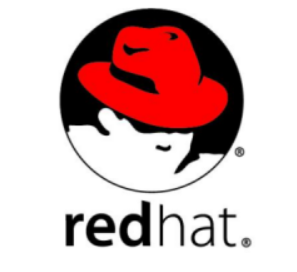


##### 2.2 Ubuntu

Ubuntu（友帮拓、优般图、乌班图）
Ubuntu的推出是在2004年9月首次宣布的。尽管这个项目在Linux发行版中是一个相对较新的。是一个以桌面应用为主的开源GNU/Linux操作系统，Ubuntu 是基于Debian GNU/Linux，支持x86、amd64（即x64）由全球化的专业开发团队（Canonical Ltd）打造的


##### 2.3 SUSE

SUSE(发音 /ˈsuːsə/)是指SUSE Linux ，openSUSE的诞生始于1992年。是德国 SuSE Linux AG公司发行维护的Linux发行版，是属于此公司的注册商标。第一个版本出现在1994年年初。2004年这家公司被收购。


##### 2.4 Debian

Debian GNU / Linux于1993年首次公布。它的创始人Ian Murdock的初始想法是在空闲时间创建一个由数百名志愿者开发的完全非商业项目。而且 Debian开发者 所创建的操作系统中绝大部分基础工具来自于GNU工程 ，因此 “Debian” 常指Debian GNU/Linux。**优点**：非常稳定;卓越的质量控制;包括超过30,000个软件包;支持比任何其他Linux发行版更多的处理器体系结构。**缺点**：保守 – 由于支持许多处理器架构，并不总是包含更新的技术;


**Mageia**


> Mageia可能是这个列表中的最新发行版，但它的来源可以追溯到1998年7月，当时GalDuval发布了Mandrake Linux。Mandrake Linux后来变成了一个商业版本，并在2010年几乎破产之前更名为Mandriva（为了避免一些与商标有关的麻烦，并与巴西的Conectiva合并），最终由一家俄罗斯风险投资公司拯救了，新管理层因为巨大的开支而决定在该公司巴黎总部裁减大部分的Mandriva开发人员。在没有工作的情况下，他们决定组建一个Mageia。**优点**：适合初学者;**缺点**：与Mandriva分开之后，缺乏声誉和资源，有人担心开发者没有能力长期维持开发


##### 2.5 Oracle Linux

Oracle Linux是Linux发行版本之一，全称为Oracle Enterprise Linux，简称OEL，是Oracle公司在2006年初发布第一个版本，以对Oracle软件和硬件支持较好见长。

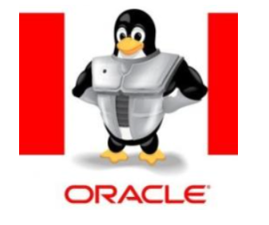

##### 2.6 CentOS

CentOS于2003年底推出，更直白地说，**CentOS是一个RHEL克隆版**。这两个发行版之间唯一的技术差异就是品牌 – CentOS用自己的所有代码取代了所有的红帽商标和标识。

CentOS（Community Enterprise Operating System，中文意思是：社区企业操作系统）是Linux发行版之一，它是来自于Red Hat Enterprise Linux依照开放源代码规定释出的源代码所编译而成。由于出自同样的源代码，因此有些要求高度稳定性的服务器以CentOS替代商业版的Red Hat Enterprise Linux使用。

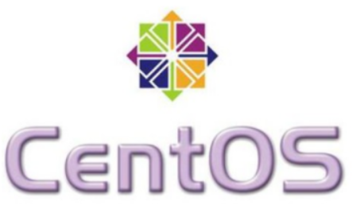

**优点**：非常稳定和可靠;免费下载和使用;有7年以上的免费安全更新;**缺点**：缺乏最新的Linux技术;有时该项目未能履行其及时提供安全更新和新稳定版本的承诺**软件包管理**：使用RPM软件包的YUM图形和命令行工具

### 3、红帽认证简介

> 红帽认证是由红帽linux公司推出的，主要包括红帽认证技师（RHCSA），红帽认证工程师（RHCE）和红帽认证架构师（RHCA）。是以实际操作能力为基础的测试项目，主要考察考生在实际操作系统中的实践能力。红帽培训和测试非常注重培养实际的动手实战能力！


### 4、Linux系统部署

##### 4.1 获取常用发行版

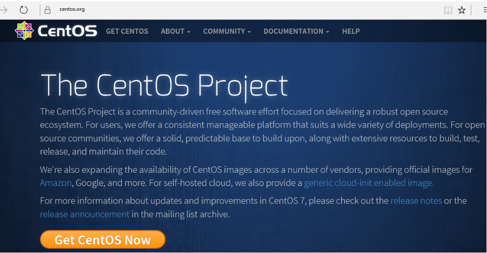

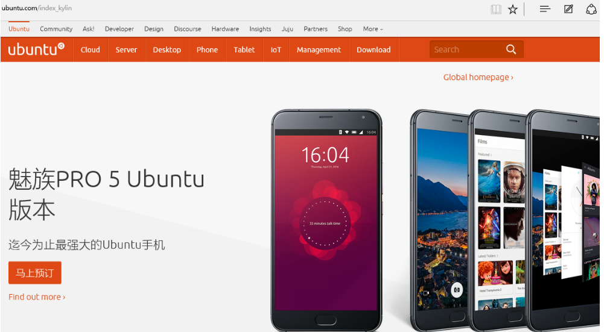

##### 4.2 非云环境安装方式

```shell
centos镜像下载
国内阿里开源镜像下载网站：https://mirrors.aliyun.com/centos/
官方：https://www.centos.org
```

​    非云环境Linux 图形安装详解

1.安装并打开VMWARE

2.在VMware中新建虚拟机

3.典型/自定义，选择自定义安装

4.虚拟机兼容性，默认下一步

5.安装来源，选择稍后安装操作系统

7.操作系统类型，选择linux centos7 64

8.自定义虚拟机名称，和文件夹位置。D:\KF\VM\Centos7-1-64

9.虚拟机CPU，默认下一步

10.内存选择，1024MB

11.网络连接，选择NAT

12.IO类型，默认下一步

13.虚拟磁盘类型，默认下一步

14.创建新磁盘，默认下一步

15.磁盘大小，默认下一步，20G

16.磁盘文件名，默认下一步

17.完成

18.在新的虚拟机，选择DVD,，选择使用ISO 镜像，选择CENTOS7 安装镜像

19.开启此虚拟机

20.install centos 7 安装操作系统21.中文，简体中文

22.软件选择:带GUI的服务器&兼容开发

23.安装位置认选择完成（自动分区）

24.点击开始安装

25.设置root密码

26.同意许可，完成配置

27.时区，用户名，密码

30.部署系统实验完成。

**怎么登录服务器**

```shell
1.首先确认服务器IP地址
2.如果是windows操作系统，下载远程连接工具如xshell、FinalShell
3.如果是mac系统，使用mac终端直接 ssh  IP地址

查看ip地址
[root@qfedu.com ~]# ip a  #查看ip地址
```

### 5、Linux系统基本操作

##### 命令提示符

1.登录root用户----超级管理员用户，权限最高

```shell
[root    @    localhost      ~    ]     #
用户            主机名    当前用户家目录  管理员用户
============
切换用户：
[root@qfedu.com ~]# su - 创建的用户名
[xuan@qfedu.com ~]$
$ ：普通用户
退出普通用户：
[xuan@qfedu.com ~]$ exit
```

```shell
查看服务器时间
[root@qfedu.com ~]# date 
[root@qfedu.com ~]# date +%F  #只显示当前年月日
[root@qfedu.com ~]# date +%X  #只显示当前时间到秒
[root@qfedu.com ~]# pwd   #显示当前工作路径
pwd ---Print working directory
```

2.查看文件信息---ls

```shell
#ls                 #查看当前目录下的文件
#ls   /root/a.txt   //单独列出文件
#ls   /home          //查看指定目录下的文件
#ls  -l     //长格式显示(显示文件的详细信息)
文件类型\权限    硬链接个数   所有者 所属组   大小    修改时间   名字 
[root@localhost ~]# ll -d /home/  #显示目录的详细信息
#ls -lh     //-h 人性化显示 （显示文件大小）
#ls -a      //all 显示所有文件 （包括隐藏文件）
案例：ls a.txt b.txt c.txt
#ls file*    #以file开头的所有文件    *通配符。表示所有字符（隐藏文件除外）
#ls *.txt     #以任意开头以.txt结尾的所有文件
[root@qfedu.com ~]# ll -d /home/  #查看目录详细信息
[root@qfedu.com ~]# ll /home/ #查看目录下面文件的详细信息
[root@qfedu.com ~]# ll -t  #按最新的修改时间排序
[root@qfedu.com ~]# clear #清屏,快捷键----ctrl+l
================================= 
#隐藏文件:文件名称前面加“.”
问题：想一想ll 与 ls -l 是什么关系？
```

3.创建文件:  touch 文件名

4.删除文件： rm -rf  文件名

5.关机：init  0    poweroff 

6.重启： reboot、init 6

**6、命令别名**

实战案例

```shell
查看别名：
[root@qfedu.com ~]# type -a ll
ll is aliased to `ls -l --color=auto'
设置别名：
语法：alias 别名='命令'
[root@qfedu.com ~]# alias ddd='df -Th'
[root@qfedu.com ~]# alias alias ddd
alias ddd='df -Th'
[root@qfedu.com ~]# ddd
Filesystem              Type      Size  Used Avail Use% Mounted on
/dev/mapper/centos-root xfs        17G  1.1G   16G   7% /
devtmpfs                devtmpfs  478M     0  478M   0% /dev
tmpfs                   tmpfs     489M     0  489M   0% /dev/shm
tmpfs                   tmpfs     489M  6.7M  482M   2% /run
tmpfs                   tmpfs     489M     0  489M   0% /sys/fs/cgroup
/dev/sda1               xfs      1014M  125M  890M  13% /boot
tmpfs                   tmpfs      98M     0   98M   0% /run/user/0
取消别名：
[root@qfedu.com ~]# unalias -a ddd
[root@qfedu.com ~]# ddd
-bash: ddd: command not found
```

**关闭防火墙与selinux**

```shell
[root@qfedu.com ~]# systemctl stop firewalld  #关闭防火墙
[root@qfedu.com ~]# systemctl disable firewalld #永久关闭防火墙
关闭selinux
[root@qfedu.com ~]# vi /etc/sysconfig/selinux  #永久关闭，需要重启机器
将文件中的SELINUX=enforcing改为disabled
[root@qfedu.com ~]# getenforce  #查看selinux是否开启
Enforcing
[root@qfedu.com ~]# setenforce 0 #临时关闭
```

**扩展**

```shell
[root@qfedu.com ~]# ifup ens33  #启动网卡
[root@qfedu.com ~]# systemctl restart network  #重启网络
ctrl+c  #终止命令
```

# 四、本章作业

1.准备英语单词领读。

2.安装一台最小化的虚拟机

3.了解本地区有哪些机房

=================================

```shell
[root@qfedu.com ~]# yum install -y cowsay
[root@qfedy.com ~]# cowsay -f tux "相思"
```

================================================================================
