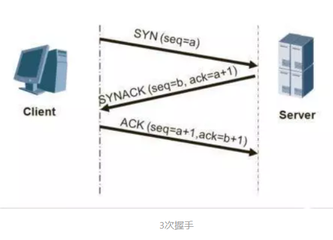
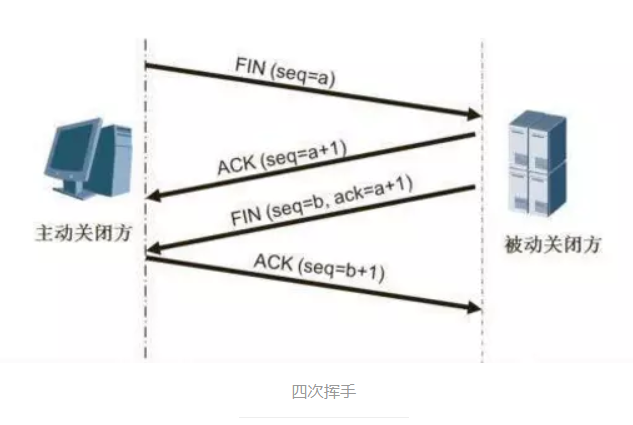

# 网络解析

```shell
每天多一点点的努力，不为别的，只为了日后能够多一些选择，选择云卷云舒的小日子，选择自己喜欢的人。
```

### 1.**TCP三次握手和四次挥手**

**1.TCP的传输过程：**

```shell
Seq   序列号   保障传输过程可靠。
ACK   （确认消息）
SYN   （在建立TCP连接的时候使用）
FIN   （在关闭TCP连接的时候使用）  
```

**3.TCP建立连接的过程：**

**三次握手**

```shell
1.）发送端首先发送一个带有SYN（synchronize）标志地数据包给接收方。
2）接收方接收后，回传一个带有SYN/ACK标志的数据包传递确认信息，表示我收到了。
3）最后，发送方再回传一个带有ACK标志的数据包，代表我知道了，表示’握手‘结束。
===================================
通俗的说法
1）Client：嘿，李四，是我，听到了吗？
2）Server：我听到了，你能听到我的吗?
3）Client：好的，我们互相都能听到对方的话，我们的通信可以开始了。
```



**四次挥手**

```shell
原理：
 1）第一次挥手：Client发送一个FIN，用来关闭Client到Server的数据传送。
 2）第二次挥手：Server收到FIN后，发送一个ACK给Client，确认序号为收到序号+1
 3）第三次挥手：Server发送一个FIN，用来关闭Server到Client的数据传送.
 4）第四次挥手：Client收到FIN后，接着发送一个ACK给Server，确认序号为收到序号+1.
======================
通俗的说法
1）Client：我所有东西都说完了
2）Server：我已经全部听到了，但是等等我，我还没说完
3）Server：好了，我已经说完了
4）Client：好的，那我们的通信结束
```



### 2.IP组成

```shell
认识IP地址
IP地址是指互联网协议地址，IP地址是IP协议提供的一种统一的地址格式，它为互联网上的每一个网络和每一台主机分配一个逻辑地址，以此来屏蔽物理地址的差异。每个ip地址由两部分组成网络地址(NetID)和主机地址(HostID).网络地址表示其属于互联网中的哪一个网络，而主机地址则表示其属于该网络中的哪一台主机.

IP地址是一个32位的二进制数，通常被分割为4个“8位二进制数”,在将2进制转换为十进制。IP地址通常用“点分十进制”表示的形式，其中都是十进制整数。

例如：
      192   .    168   .   223   .   3               /24
  11000000 . 10101000 . 11011111 . 00000011
```

**进制转换**

```shell
一：十进制转换为二进制
        十进制整数转换为二进制整数采用"除2取余，逆序排列"法。具体做法是：用2整除十进制整数，可以得到一个商和余数；再用2去除商，又会得到一个商和余数，如此进行，直到商为小于1时为止，然后把先得到的余数作为二进制数的低位有效位，后得到的余数作为二进制数的高位有效位，依次排列起来。        
（IP地址里面一共是32位，通常被分割为4个“8位二进制数”--将这8位列出来，2^0次方开始算，能用到的数落1不能用到的为0）

 
128  64  32  16  8  4  2  1 =255

  192     .    168   .   223   .    0     /24
11000000       10101000  11011111  00000000

128 64 32 16 8 4 2 1

   172    .    0   .    186    .     0     /24
10101100    00000000   10111010    00000000

二、二进制转十进制

128 64 32 16 8 4 2 1

 10.50.4.3
00001010.00110010.00000100.00000011

10101100.00000000.10111010.00000000
  172.0.186.0
```

**IP分类**

```shell
公网ip地址--->合法的IP地址，可以在互联网上访问
===========================
A类：0.0.0.0 - 127.255.255.255/8   0是保留的并且表示所有IP地址，而127也是保留的地址，并且是用于测试回环用的。127.0.0.1，通常被称为本地回环地址。
B类：128.0.0.0 - 191.255.255.255/16
C类：192.0.0.0 - 223.255.255.255/24   目前我们用的ip地址
D类：范围从224-239，D类IP地址目前这一类地址用来一次寻址一组计算机。224.0.0.0-239.255.255.255 组播地址
E类：范围从240-254，为将来使用保留。 

全零（“0．0．0．0”）地址对应于当前主机。IP地址（“255．255．255．255”）是当前子网的广播地址。
```

###### 私有地址

所谓的私有地址就是在互联网上不使用，而被用在局域网络中的地址

> 在A类地址中，10.0.0.0到10.255.255.255是私有地址
>
> 在B类地址中，172.16.0.0到172.31.255.255是私有地址。
>
> 在C类地址中，192.168.0.0到192.168.255.255是私有地址。

**IP地址的组成**

```shell
子网掩码：用于区分IP地址中的网络部分和主机部分.计算子网掩码:网络位全1，主机位全0
网络部分（网络位）：直接决定了可以分配的网络数
主机部分（主机位）：则决定了网络中最大的主机数 计算方法：2^主机号位数-2
网络地址：用来表示一个网络。主机位取值全部为0，例如：192.168.1.0/24  
广播地址：用于在一个网络内一对所有的通信。主机部分全部换成1。
```

```shell


128   64   32    16    8    4   2    1

192.168.62.138/24
255.255.255.0  ---子网掩码地址
11000000.10101000.00111110.10001010 (主机位？2^8-2=254)
11000000.10101000.00111110.00000000 网络地址    192.168.62.0/24
11000000.10101000.00111110.11111111 广播地址    192.168.62.255
可用的主机范围从--->192.168.62.1-192.168.62.254

192.168.62.138/16-----255.255.0.0
11000000.10101000.00111110.10001010 
11000000.10101000.00000000.00000000 网络地址    192.168.0.0/16
11000000.10101000.11111111.11111111 广播地址    192.168.255.255
可用的主机范围是2^16-2
```

### 3.VLSM(可变长子网掩码Variable Length Subnet Mask) 

VLSM(可变长子网掩码Variable Length Subnet Mask) **最有效的利用现有地址空间。**

```shell
子网掩码：用于区分IP地址中的网络部分和主机部分。点分十进制(网络位全部为1)

128   64   32    16    8    4   2   1

10.1.12.133/24-255.255.255.0
00001010.00000001.00001100.10000101  →0000000-->网络地址是将主机位变为0=10.1.12.0/24
广播地址将主机位10000101→1111111 --->广播地址=10.1.12.255
掩码将网络位全部为1---->255.255.255.0                                          
===========================================================
10.1.12.1/24  ---计算掩码
00001010.00000001.00001100.00000001
11111111.11111111.11111111.00000000=255.255.255.0
=================================================================
```

```shell
子网划分：
a.这个被选用的子网可以产生多少的子网？   2的x次方=？   x表示借的主机位
b.这个子网中又会有多少个合法的主机号？   2的y次方-2=？ y表示主机位
c.每个子网的广播地址是什么？           这个子网中最后一个IP地址

假如有120台电脑分配地址--主机位？

192.168.1.0/24        11000000.10101000.00000001.00000000

128 64 32 16 8 4 2 1 
  
例如：计算主机位？2的多少次方-2大于等于120？--2^7次方-2=126
192.162.1.0/25        11000000.10101000.00000001.0    0000000 #1/0两个子网---(0,1)

当为0时：192.168.1.0/25 ---网络地址
192.168.1.127---广播
可用主机范围2^7-2=有126个
192.168.1.1-192.168.1.126

当为1时：192.168.1.128/25 ---网络地址
192.168.1.255---广播
可用主机范围有126个
192.168.1.129-192.168.1.254
                                          
30台--主机位？2的多少次方-2大于等于30？--2^5-2=30 
11000000.10101000.00000001.000    00000  借走的子网【000、001、010、100、111、110、101、011】
192.168.1.0/27
255.255.255.224 子网掩码
网络位192.168.1.0---192.168.1.31--广播
可用主机范围：192.168.1.1---192.168.1.30

11000000.10101000.00000001.001   00000
192.168.1.0/27
网络地址--192.168.1.32----192.168.1.63---广播地址
可用主机范围：192.168.1.33---192.168.1.62

128 64 32 16 8 4 2 1
```


**练习题**

```shell
1.将下面的十进制转换为二进制
172.14.23.4
192.168.33.45
2.将二进制转换为十进制
00001010.00000001.00000001.00010100
11000000.10101000.00010100.01010100
```
