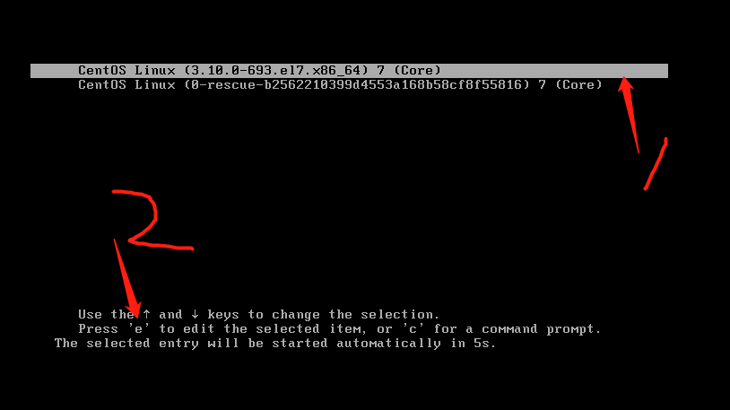
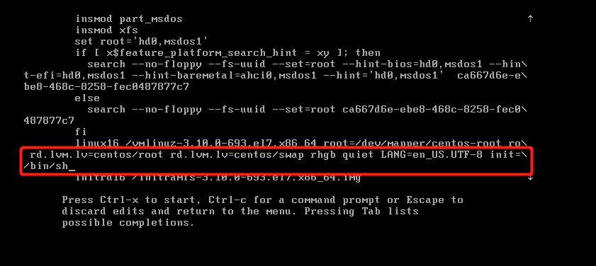
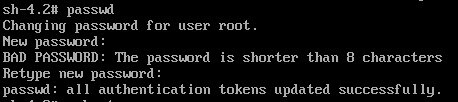

# 文件查找与打包压缩

```shell
千磨万击还坚韧，任尔东西南北风。
```

##### grep:  文件内容过滤 

```shell
[root@qfedu.com ~]# grep 'root' /etc/passwd  #从/etc/passwd文件中过滤root字段
root:x:0:0:root:/root:/bin/bash
operator:x:11:0:operator:/root:/sbin/nologin
```

##### 查找命令

```shell
[root@qfedu.com ~]# which ls
alias ls='ls --color=auto'
        /usr/bin/ls
[root@qfedu.com ~]# which cd
/usr/bin/cd
[root@qfedu.com ~]# which rm
alias rm='rm -i'
        /usr/bin/rm
```

##### 查询命令和配置文件的位置

```shell
[root@qfedu.com ~]# whereis rpm 
rpm: /usr/bin/rpm /usr/lib/rpm /etc/rpm /usr/share/man/man8/rpm.8.gz
[root@qfedu.com ~]# whereis passwd
passwd: /usr/bin/passwd /etc/passwd /usr/share/man/man1/passwd.1.gz
```

### 一、find详解:   文件查找，针对文件名

```shell
语法：
#find 路径 条件 跟条件相关的操作符   [-exec 动作]
路径:
1.默认不写路径时查找的是当前路径.
2.加路径。
条件：
1.指定的名称  -name
2.文件类型  -type
3.权限
4.时间
```

##### 1.1.按文件名

```shell
从根开始找文件
[root@qfedu.com ~]# find / -name “file2” #从根开始找文件
/root/file2
/var/tmp/file2
[root@qfedu.com ~]# find /etc -name "ifcfg-ens33" #以名字的方式查找 
[root@qfedu.com ~]# find /etc -iname "Ifcfg-ens33" #-i忽略大小写
```

**熟用*通配符**

```shell
[root@qfedu.com ~]# find /etc -iname "*.txt"
参数解释：
*：表示所有字符
```

##### 1.2.按文件大小    -size

```shell
[root@qfedu.com ~]# find /etc -size +5M		#大于5M
[root@qfedu.com ~]# find /etc -size 5M		#等于5M
[root@qfedu.com ~]# find /etc -size -5M      #小于5M
[root@qfedu.com ~]# find / -size +3M -a -size -5M  #查找/下面大于3M而且小于5M的文件
-a：add
[root@qfedu.com ~]# find / -size -1M -o -size +80M #查找/下面小于1M或者大于80M的文件
-o：or
[root@qfedu.com ~]# find / -size -3M -a -name "*.txt" #查找/ 下面小于3M而且名字是.txt的文件
```

##### 1.3按时间查找

```shell
按时间找(atime,mtime,ctime)
-atime=  access访问时间
-mtime = modify改变时间  内容修改时间会改变
-ctime =change修改时间   属性修改时间会改变

-amin  #分钟
-mmin
-cmin
```

```shell
[root@qfedu.com ~]# find /opt -mtime +5		#修改时间5天之前
[root@qfedu.com ~]# find /opt -atime +1     #访问时间1天之前
[root@qfedu.com ~]# find . -mtime -2		#修改时间2天之内

[root@qfedu.com ~]# find . -amin +1         #访问时间在1分钟之前
[root@qfedu.com ~]# find /opt -amin -4      #访问时间在4分钟之内
[root@qfedu.com ~]# find /opt -mmin -2      #修改时间在2分钟之内
```

##### 1.4按文件类型

```shell
[root@qfedu.com ~]# find /dev -type f	#f普通文件
[root@qfedu.com ~]# find / -type f -size -1M -o -name "*.txt"

[root@qfedu.com ~]# find /dev -type d	#d目录
[root@qfedu.com ~]# find /etc/ -type d -name "*.conf.d"

[root@qfedu.com ~]# find /etc -type l	#l链接

[root@qfedu.com ~]# find /dev -type b	#b块设备
[root@qfedu.com ~]# find /dev/ -type b -name "sd*"
```

##### 1.5按文件权限

```shell
[root@qfedu.com ~]# find . -perm 644            #.是当前目录    精确查找644  
[root@qfedu.com ~]# find /usr/bin  -perm -4000  #包含set uid
[root@qfedu.com ~]# find /usr/bin  -perm -2000  #包含set gid
[root@qfedu.com ~]# find /usr/bin  -perm -1000  #包含sticky
```

##### 1.6找到后处理的动作        

```shell
-name "ifcfg*" | xargs
-name "ifcfg*" -print   #打印
```

```shell
[root@qfedu.com ~]# find /etc -name "ifcfg*" -exec cp -rf {} /tmp \; #exec命令对之前查找出来的文件做进一步操作-----  查找带ifcfg开头的文件复制到tmp下
[root@qfedu.com ~]# touch /home/test{1..20}.txt
[root@qfedu.com ~]# find /home/ -name test* -exec rm -rf {} \; #｛｝为前面查找到的内容,\; 格式
```

**find使用xargs**

```shell
[root@qfedu.com ~]# touch /home/test{1..20}.txt
[root@qfedu.com ~]# # find /home/ -name "test*" | xargs -i cp {} /tmp/ #找到之后删除处理xargs 参数传递
```

**-exec和xargs的区别**

```shell
-exec:参数是一个一个传递的，传递一个参数执行一次命令。
xargs:将前一个命令的标准输出传递给下一个命令，作为它的参数转换成下一个命令的参数列表。
===============
1、exec 每处理一个文件或者目录，它都需要启动一次命令，效率不好; 
2、exec 格式麻烦，必须用 {} 做文件的代位符，必须用 \来转义; 作为命令的结束符，书写不便。 
3、xargs不能操作文件名有空格的文件；

综上，如果要使用的命令支持一次处理多个文件，并且也知道这些文件里没有带空格的文件，
那么使用 xargs比较方便; 否则，就要用 exec了。
```


# 二、打包压缩

window打包压缩工具：

```shell
结尾：.rar     .zip
打包工具：winrar zip 7zip 好压
```

**linux打包压缩工具：**

```shell
结尾：.tar.gz      .tar.bz2     .zip
```

```shell
工具：gzip和tar(打包)  unzip 解决  .zip 

bzip2（只压缩）
```

**打包**

```shell
语法:
#tar cvf xxxx.tar filename   被打包的文件 ...
c ：create  创建
v ：verbose 详细信息
f ：file  文件
```

**解包**

```shell
#tar xvf filename.tar [-C /root/Desktop]
x： extract  解压缩  解包
-C： 指定解包路径
```

**案例**

```shell
[root@qfedu.com ~]# tar cvf dir1.tar /home/dir10/ #打包目录dir10，将包命名为dir1.tar
[root@qfedu.com ~]# tar xf dir1.tar -C /usr/local/ #将dir1包解压到指定目录
```

**压缩**

```shell
gzip bzip2

语法:
压缩:
	#gzip  源文件   #格式  file.gz结尾
	#bzip2 源文件   #格式  file.bz2结尾
```

**bzip2需要安装**

```shell
[root@qfedu.com ~]# yum -y install bzip2  #打包bzip2需要安装
```

**解压缩**

```shell
语法:
#gunzip    压缩文件
#bunzip2   压缩文件
#gzip 	-d 压缩文件  
#bzip2  -d 压缩文件
-d：dicompress 解压缩
```

**案例**

```shell
[root@qfedu.com ~]# gzip file1  #压缩
[root@qfedu.com ~]# gzip -d file1.gz #解压缩
[root@qfedu.com ~]# gunzip file1.gz  #也是解压缩包
[root@qfedu.com ~]# gzip -c file1 > /usr/local/file1.gz  #压缩到指定位置(注意以.gz结尾)
[root@qfedu.com ~]# gunzip -c /usr/local/file1.gz > /opt/file1 #解压到指定位置（解压出的名字可以自定义）
-c, --stdout
```

**打包压缩一起:**

```shell
语法:
#tar cvzf file.tar.gz  源文件
#tar cvjf file.tar.bz2 源文件
z：表示gz压缩
j：表示bz2压缩
```

**解压解包一起:**

```shell
语法:
#tar xvzf 压缩文件 [-C 解压路径]
#tar xvjf 压缩文件 [-C 解压路径]
```

**案例**

```shell
[root@qfedu.com ~]# tar czf dir1.tar.gz dir1              #打包并压缩
[root@qfedu.com ~]# tar xzf dir1.tar.gz -C /usr/local/    #解压到指定位置
```

**打包到指定路径**

```shell
[root@qfedu.com ~]# tar czf /tmp/`date +%F-%X`-etc.tar.gz /etc/  #将打包的文件放到/tmp目录下，并以当前时间开头命名
```

**扩展--按时间创建目录或者文件**

```shell
# mkdir `date +%F`-upload
# touch file-`date +%F`.txt
```

**作业**

```shell
查找系统内所有.gz结尾的文件并备份到/tmp/backup目录下
查找10天以内被修改过的.txt结尾的文件
```

# 三.链接文件

**软链接 或 符号链接 硬链接**

#### 4.1.硬链接 

```shell
一般情况下，文件名和inode号码是"一一对应"关系，每个inode号码对应一个文件名。但是，Unix/Linux系统允许，多个文件名指向同一个inode号码。
这意味着，可以用不同的文件名访问同样的内容；对文件内容进行修改，会影响到所有文件；但是，删除一个文件名，不影响另一个文件名的访问。这种情况就被称为"硬链接"（hard link）。
```

```shell
[root@qfedu.com ~]# echo 222 > /file2
[root@qfedu.com ~]# ll -i /file2                 #-i：显示inode编号
34045994 -rw-r--r-- 1 root root 4 Dec 29 20:52 file2
[root@qfedu.com ~]# ln /file2 /file2-h1
[root@qfedu.com ~]# ll -i /file2 /file2-h1       #查看inode号
34045994 -rw-r--r-- 2 root root 4 7月  30 22:25 /file2
34045994 -rw-r--r-- 2 root root 4 7月  30 22:25 /file2-h1

[root@qfedu.com ~]# rm -rf /file2        #删除源文件
[root@qfedu.com ~]# ll -i /file2-h1      #查看链接文件
34045994 -rw-r--r--. 3 root root 4 Nov  9 15:01 /file2-h1
查看:
[root@qfedu.com ~]# cat /file2-h1
222
```

```shell
运行上面这条命令以后，源文件与目标文件的inode号码相同，都指向同一个inode。inode信息中有一项叫做"链接数"，记录指向该inode的文件名总数，这时就会增加1。

反过来，删除一个文件名，就会使得inode节点中的"链接数"减1。当这个值减到0，表明没有文件名指向这个inode，系统就会回收这个inode号码，以及其所对应block区域。
```

#### 4.2.软连接

```shell
除了硬链接以外，还有一种特殊情况

文件A和文件B的inode号码虽然不一样，但是文件A的内容是文件B的路径。读取文件A时，系统会自动将访问者导向文件B。因此，无论打开哪一个文件，最终读取的都是文件B。这时，文件A就称为文件B的"软链接"（soft link）或者"符号链接（symbolic link）。

这意味着，文件A依赖于文件B而存在，如果删除了文件B，打开文件A就会报错："No such file or directory"。这是软链接与硬链接最大的不同：文件A指向文件B的文件名，而不是文件B的inode号码，文件B的inode"链接数"不会因此发生变化。
```

**ln -s 命令可以创建软链接。**　  

```shell
语法：ln -s  源文件  链接文件

[root@qfedu.com ~]# echo 111 > /file1
[root@qfedu.com ~]# ll -i /file1 
545310 -rw-r--r-- 1 root root 4 7月  30 22:06 /file1
[root@qfedu.com ~]# ln -s /file1 /file11		#将文件file1软链接到file11
[root@qfedu.com ~]# ll /file11 
lrwxrwxrwx 1 root root 6 Dec 20 17:58 /file11 -> /file1

[root@qfedu.com ~]# ll -i /file11 /file1    #查看inode号
545310 -rw-r--r-- 1 root root 4 7月  30 22:06 /file1
545343 lrwxrwxrwx 1 root root 6 7月  30 22:06 /file11 -> /file1

[root@qfedu.com ~]# cat /file1 
111
[root@qfedu.com ~]# cat /file11 
111

[root@qfedu.com ~]# rm -rf /file11 #取消软连接。

[root@qfedu.com ~]# ln -s /file1 /file11
[root@qfedu.com ~]# rm -rf /file1  #删除源文件
[root@qfedu.com ~]# ll /file11 
lrwxrwxrwx 1 root root 6 Dec 20 17:58  /file11 -> /file1   #已失效

#给目录设置软链接必须是绝对路劲
[root@qfedu.com ~]# ln -s /root/aaa/ /usr/bbb
[root@qfedu.com ~]# ll /usr/bbb
lrwxrwxrwx 1 root root 10 Dec 29 21:08 /usr/bbb -> /root/aaa/
[root@qfedu.com ~]# rm -rf /usr/bbb  #取消链接，注意:删除目录链接时目录后面加“/”是删除目录，不加是删除链接
```

**把一些重要文件做多个链接**

```shell
注：硬链接 
1. 不能跨文件系统
2. 不支持目录做硬链接
```

```shell
 [root@qfedu.com ~]# ln /root/aaa/ /mnt/bbb
ln: "/root/aaa/": 不允许将硬链接指向目录
```

**面试：软链接和硬链接的区别：**

```shell
- 软链接可以跨文件系统，硬链接不可以；
- 软链接可以对目录进行连接，硬链接不可以；
- 删除源文件之后，软链接失效，硬链接无影响；
- 两种链接都可以通过命令 ln 来创建；
- ln 默认创建的是硬链接；
- 使用 -s 参数可以创建软链接。
```

# 四、破解密码---扩展

```shell
# cat /etc/redhat-release 
CentOS Linux release 7.7.1908 (Core)
```

```shell
修复模式：
1，特权模式：不需要root密码，直接以root账户身份登陆。
破解密码时特权模式。
```

```shell
1.重起系统,进入grub菜单
2.选择要使用的内核
3.按e
```



```shell
4.找到linux16那一行，把光标移动到最后，添加 init=/bin/sh
5.ctrl+x #保存退出
```



```shell
6.进入系统后，以rw方式重新挂载/分区
#mount -o remount,rw   /
7.永久关闭selinux
#vim /etc/sysconfig/selinux
8.修改密码
```



```shell
9.  # touch /.autorelabcl  #重新识别新的root密码
10. # exec /sbin/init  #重启机器，
```

**测试登录**